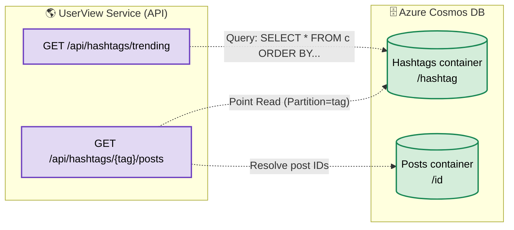
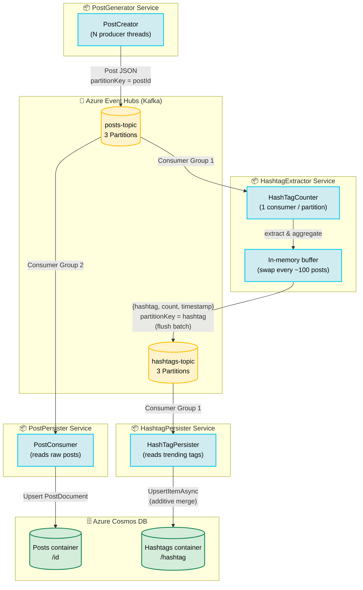

# HashtagService — Architecture Diagram

## 1. Read Path

Below is the user-facing read (query) path, demonstrating how clients query trending hashtags and associated posts via the APIs.

 

## 2. Write Path

Below is the event-driven ingestion path from generating raw posts to storing optimized search documents in the database.

## Data Flow Summary

| Stage | Component | Reads From | Writes To | Partition Key | Notes |
|---|---|---|---|---|---|
| 1 | **PostCreator** | — | `posts-topic` | `post.Id` | N threads, batched sends |
| 2a | **PostPersister** | `posts-topic` | Cosmos DB `Posts` | `/id` | Reads raw posts and inserts them into the database for lookup |
| 2b | **HashTagCounter** | `posts-topic` | `hashtags-topic` | `hashtag` string | 1 consumer per partition; in-memory aggregation; buffer swap every ~100 posts |
| 3 | **HashTagPersister** | `hashtags-topic` | Cosmos DB `Hashtags` | `/hashtag` | Additive upsert; at-least-once safe (idempotent merge) |
| 4 | **UserView** | Cosmos DB | HTTP clients | — | Read-only query API for trending hashtags and post metadata |

## Key Design Points

- **Partition alignment** — `posts-topic` uses `postId` for even distribution; `hashtags-topic` uses the hashtag string so all counts for the same hashtag land on the same partition → single-writer per hashtag in the persister.
- **Buffer-swap aggregation** — HashTagCounter accumulates `{hashtag → count}` in memory. Every ~100 posts it atomically swaps to a fresh buffer and flushes the old one as a batch of `{hashtag, count, timestamp}` messages. This reduces downstream event volume by orders of magnitude.
- **At-least-once / additive merge** — HashTagPersister reads a `{hashtag, count}` message and does `totalPostCount += count` via read-modify-write upsert. Duplicate deliveries may inflate counts slightly; acceptable for a POC (exactly-once requires conditional writes with ETags).
- **Checkpoint after write** — Both consumers checkpoint to Blob Storage only after successful downstream write, ensuring no data loss on crash.
